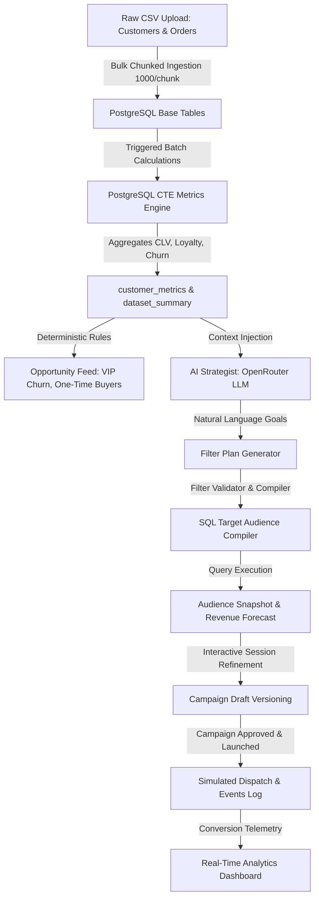

# Catalyst - AI-Native Marketing Strategist & CRM Platform

Catalyst is a premium, enterprise-grade AI-native Customer Relationship Manager (CRM) and Campaign Optimization platform. By combining a high-performance raw data ingestion pipeline with an autonomous analytical layer and a conversational AI strategist, Catalyst enables marketing teams to turn raw customer transaction logs into high-converting, personalized campaigns in seconds.

---

## System Architecture & Data Flow

Catalyst separates ingestion, batch analytical computations, and generative AI orchestration to ensure sub-second UI responsiveness, absolute data safety, and robust campaign forecasting.

---

## Database Schema & Data Models

Catalyst leverages a structured relational database with robust indexes, foreign keys with cascading deletions, and distinct constraints to maintain data integrity.

### Schema Breakdown

1. **Brands (`brands`)**: The tenant base table. All customer, order, and campaign data is scoped via a `brand_id` UUID.
2. **Customers (`customers`)**: Raw demographic details.
   - Enforces unique indexing on `(brand_id, external_customer_id)`, `(brand_id, email)`, and `(brand_id, phone)` to handle upserts gracefully and eliminate duplicates.
3. **Orders (`orders`)**: Log of raw customer transactions containing status, currencies, amounts, and transaction dates.
   - Enforces unique indexing on `(brand_id, external_order_id)`.
4. **Customer Metrics (`customer_metrics`)**: Batch-calculated analytics table acting as a persistent Cache for audience filtering.
   - Tracks CLV, purchase frequencies, average order values (AOV), loyalty scores, and churn risk levels.
5. **Strategist Session & Message Logs (`strategist_sessions`, `strategist_messages`)**: Keeps track of conversational states and AI-assisted drafting history.
6. **Campaign Drafts (`campaign_drafts`)**: JSONB-based document store supporting multi-version campaign planning and milestones.
7. **Campaigns & Communications (`campaigns`, `communications`, `communication_events`, `campaign_metrics`)**: Manages campaign status (`DRAFT`, `APPROVED`, `RUNNING`, `COMPLETED`, `FAILED`), targeting filters, simulated delivery queues, and telemetry logs (Sent, Delivered, Opened, Clicked, Purchased).
8. **Business Intelligence (`business_insights`, `campaign_intelligence_summaries`, `executive_briefs`)**: Stores opportunity detector alerts, channel efficacy matrixes, and executive briefs.

---

## Mathematical & Statistical Core Models

Catalyst replaces arbitrary heuristics with solid mathematical and window-based SQL metrics compiled natively inside PostgreSQL using Common Table Expressions (CTEs). To prevent markdown rendering conflicts on platforms like GitHub, all variable names are written using clean spacing inside text blocks rather than raw underscores.

### 1. Inter-Purchase Interval & Order Gaps
To track customer order patterns, Catalyst computes the delta between successive transactions per customer:

$$\text{gap} = \text{order date} - \text{LAG}(\text{order date}) \text{ OVER (PARTITION BY customer id ORDER BY order date)}$$

The average gap interval is calculated per customer as:

$$\text{avg days between orders} = \frac{1}{N - 1} \sum_{i=1}^{N - 1} \text{gap}_i$$

### 2. Weighted Loyalty Score
The loyalty score ($L \in [0, 100]$) assesses a customer's strength across Spend, Frequency, and Recency:

$$L = w_1 \cdot S_{\text{rank}} + w_2 \cdot F_{\text{score}} + w_3 \cdot R_{\text{score}}$$

Where:
*   **Spend Rank ($S_{\text{rank}}$ - 40% Weight)**: Customer's position relative to the brand's percentile ranks ($p_0$ to $p_{100}$ spend):
    $$S_{\text{rank}} = \frac{\min(\text{total spend}, p_{100}) - p_0}{p_{100} - p_0} \times 40$$
*   **Frequency Score ($F_{\text{score}}$ - 40% Weight)**: Average monthly purchases capped at a maximum factor of 10:
    $$F_{\text{score}} = \min(\text{purchase frequency}, 10) \times 4$$
*   **Recency Score ($R_{\text{score}}$ - 20% Weight)**: Measures the delay of the last order relative to the average brand gap:
    $$R_{\text{score}} = \max\left(0, \left(1 - \min\left(\frac{\text{days since last purchase}}{\text{brand avg gap days}}, 1\right)\right) \times 20\right)$$

### 3. Predictive Churn Score
The churn score ($C \in [0, 100]$) tracks the likelihood of customer churn by comparing the current inactivity window to their historical order frequency:

$$C = \min\left(\left(\frac{\text{days since last purchase}}{\text{avg days between orders}}\right) \times 100, 100\right)$$

---

## AI Strategist & Validation Pipeline

Catalyst integrates a state-of-the-art LLM workflow (via OpenRouter OpenAI models) that drives interactive planning.

### Natural Language to SQL Compilation
Instead of relying on unstable SQL generation that could expose the database to structure disclosure or security risks, Catalyst uses a multi-layered validation compiler:
1. **Goal Analysis**: The AI reads the user's natural language goal and brand context to produce a structured JSON Filter Plan.
2. **Filter Validation Engine (`validateFilterPlan`)**: The backend parses this plan against a strict `metric_registry` whitelist. Only approved fields, operators ($>, <, =, \text{IN}$, etc.), and types (number, string) are allowed. Unsupported elements or syntax trigger a graceful fallback.
3. **Query Compiler (`buildAudienceQuery`)**: Compiles validated JSON plans into fully parameterized SQL query strings, protecting the database from SQL injection attacks.
4. **Simulation & Forecasting**:
   - Compiles audience size dynamically.
   - Calculates statistical conversion forecasts (e.g. Expected Revenue = Forecased Conversions $\times$ Average Order Value).

---

## ⚡ Performance Optimization & Technical Stack

### Technical Stack
*   **Frontend**: React 19, TypeScript, Vite 8, Framer Motion, Tailwind CSS, Recharts.
*   **Backend**: Node.js, Express 5, PostgreSQL, OpenRouter AI, pg-format, csv-parse.

### Key Optimization Implementations

*   **Responsive Smooth-Scroll Pipeline**:
    *   Powered by a custom `SmoothScrollProvider` wrapping **Lenis** with `duration: 0.8`, `lerp: 0.1`, and `autoResize: true`.
    *   **Responsive Guard**: Dynamically detects touch devices and viewport sizes ($< 768\text{px}$). Disables smooth-scroll on mobile to rely on native touch physics, preventing scroll jitter and trackpad lockups.
*   **Lazy Chart Rendering**:
    *   To prevent main-thread blocking during complex layout rendering, heavy dashboard graphs are lazily mounted with a micro-delay, presenting sleek skeleton loaders to keep page navigation instantaneous.
*   **Chunked Ingestion Pipeline**:
    *   CSV imports are processed in memory and written in batch chunks of 1,000 records using parameterized `pg-format` helper arrays, maintaining ultra-low SQL parsing overhead.
*   **Unique Index Upserts**:
    *   Resolves duplicates at the database layer using `ON CONFLICT (brand_id, external_customer_id) DO UPDATE SET` clauses.

---

## Scale & Limits (In Numbers)

| Metric / Boundary | Value | Technical Context |
| :--- | :--- | :--- |
| **Max Concurrent Ingestion Scale** | 10,000 customers & 100,000 orders | Successfully parsed, linked, and analyzed in a single upload batch |
| **Concurrent Campaigns** | 30 - 40 campaigns | Active campaign loops running concurrently under asynchronous batch processing and job queue management |
| **Ingestion Chunk Size** | 1,000 records | Optimal database batch insert size for low lock-contention |
| **Max Filter Limit** | 5 filters per plan | Prevents excessive JOIN overhead |
| **Rate Limit (General)** | 10,000 req / 15 mins (dev) \| 100 req / 15 mins (prod) | Protects key REST routes |
| **Rate Limit (Uploads)** | 1,000 req / 10 mins (dev) \| 5 req / 10 mins (prod) | CPU/Network protective limits in production |

---

## Future Roadmap & Scaling Strategy

1. **Distributed Task Queue**: Offload CSV file parsing and analytics batch jobs to Redis-backed message brokers like **BullMQ** or **Celery** to handle millions of records.
2. **Event Streaming**: Introduce **Apache Kafka** or RabbitMQ to stream order events in real-time and compute metrics incrementally rather than in full-table recalculation batches.
3. **Caching Layer**: Integrate **Redis** caching for static dashboard analytics summaries, executive brief text blocks, and active chat logs.
4. **RBAC Authentication**: Standardize secure tenant segregation with OAuth 2.0 / JWT and Role-Based Access Control.
